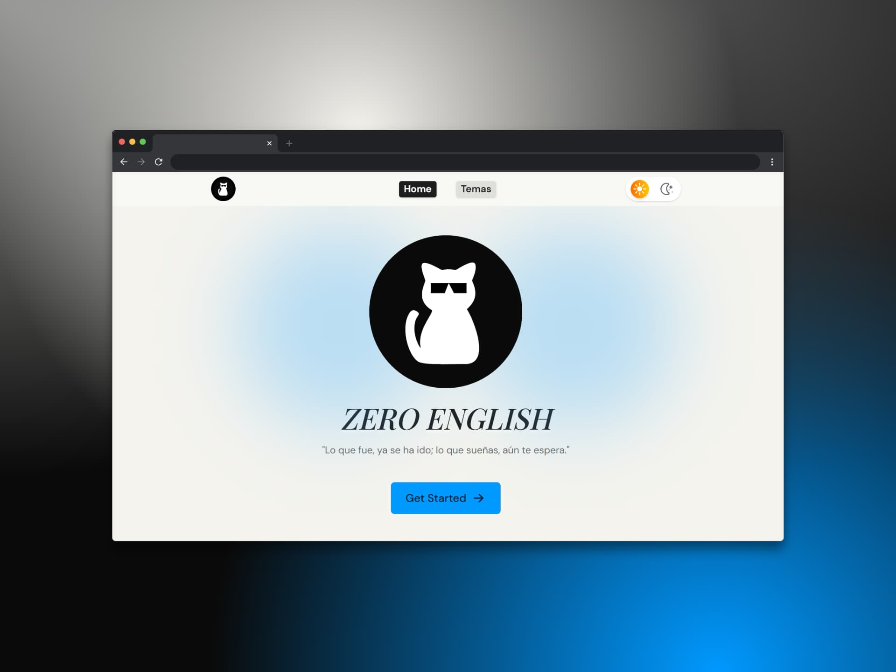

# ZERO ENGLISH 😸

El objetivo de este proyecto es documentar mi trayectoria en el aprendizaje del inglés. A través de este repositorio, busco reflejar de manera tangible mi progreso, desde los conceptos más básicos hasta lograr fluidez en el idioma.



## 🛠️ Tecnologías usadas para la construcción de este proyecto

- Framework: [Astro](https://astro.build/) 🚀
- Contenido: [MDX](https://mdxjs.com/) 🩻
- Estilos: [Tailwind CSS](https://tailwindcss.com/) 🎨

## 🧱 Estructura del proyecto

```text
zero-english/
├── public/
├── src/
│   ├── assets/
│   │   └── images/
│   ├── components/
│   │   ├── english/
│   │   ├── icons/
│   │   ├── layout/
│   │   └── ui/
│   ├── content/
│   │   └── english/
│   │       └── example.mdx
│   ├── data/
│   │    └── data.ts
│   ├── layouts/
│   │   └── Layout.astro
│   ├── pages/
│   │   ├── english/
│   │   │   ├── [slug].astro
│   │   │   └── index.astro       
│   │   └── index.astro
│   ├── styles/
│   │    └── global.css
│   └── types/
│       └── types.ts
├── CHANGELOG.md
├── LICENSE
├── package.json
├── .gitignore
├── .prettierrc
├── astro.config.mjs
├── tsconfig.json
├── package-lock.json
└── README.md
```

>Made by Marisol Henao - Proyecto personal educativo (2025)

<h3 align="center">< seandsun /></h3>